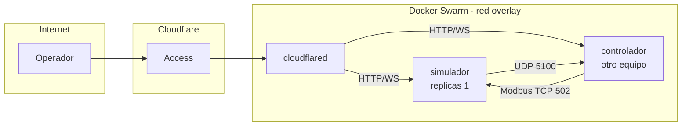

# Despliegue

## Topología

Tres contenedores en un stack de Docker Swarm sobre un mismo nodo.

| Servicio | Papel | Réplicas |
|---|---|---|
| `simulador` | Núcleo, servidor Modbus, emisor UDP, interfaz web | 1, siempre |
| `controlador` | Software bajo prueba, de otro equipo | 1 |
| `cloudflared` | Túnel saliente hacia Cloudflare | 1 |

## Comunicación interna

Simulador y controlador se resuelven **por nombre de servicio** sobre la red overlay. El
controlador abre la conexión Modbus contra `simulador:502`; el simulador emite UDP contra
`controlador:5100`.

!!! danger "Ningún puerto de protocolo industrial se publica"
    Ni el 502 ni el 5100 se publican al host ni a internet
    ([D-03](../alcance/decisiones.md#d-03-el-puerto-502-no-se-publica)). Un endpoint Modbus
    accesible desde fuera sería un servicio sin autenticación de ningún tipo, y no aporta nada:
    el único maestro vive en la misma red overlay.

Como el emisor UDP resuelve el destino por nombre, un reinicio del contenedor del controlador
cambia su IP sin que haya que reconfigurar nada. El emisor debe **re-resolver el nombre
periódicamente**, no cachear la IP de por vida: es un fallo silencioso clásico, porque UDP no
avisa de que nadie escucha.

## Acceso desde fuera

Solo las interfaces web salen, y salen por el túnel. `cloudflared` abre una conexión saliente
hacia Cloudflare; **no hay puertos de entrada abiertos en el nodo**. Cloudflare Access se
encarga de la autenticación antes de que ningún tráfico llegue al stack.

!!! note "Cloudflare no ejecuta nada del emulador"
    Cloudflare aporta túnel y autenticación, no runtime
    ([D-05](../alcance/decisiones.md#d-05-cloudflare-queda-como-tunel-y-autenticacion-no-como-runtime)).
    El núcleo no puede correr en Workers porque Workers no admite listener TCP ni emisión UDP,
    y ambos son interfaces nucleares de este sistema.

## Consecuencias operativas

**Sin alta disponibilidad.** El simulador es `replicas: 1` por diseño
([D-02](../alcance/decisiones.md#d-02-el-simulador-es-replicas-1)). Si el contenedor cae, la
sesión en curso se pierde. Aceptable en un banco de pruebas.

**La demo comparte estado.** No hay aislamiento entre visitantes: todos operan el mismo radar.
La interfaz debe mostrar el número de operadores conectados y atribuir cada forzado a su actor
en el registro, para que un comportamiento inesperado no se atribuya al controlador cuando lo
causó otra persona.

**Reinicio limpio.** Al arrancar, el simulador carga la configuración, abre una sesión nueva y
empieza a emitir. No recupera el estado de la sesión anterior: el registro de eventos persiste
en disco pero el estado de señales no. Esto es deliberado, una prueba debe empezar desde un
estado conocido.

## Volúmenes

| Ruta | Contenido | Persistencia |
|---|---|---|
| `/data/config` | Ficheros JSON de configuración | necesaria |
| `/data/events` | Base SQLite del registro de eventos | necesaria |
| `/data/scenarios` | Escenarios y aserciones | necesaria |

## Reloj

!!! warning "Ningún timestamp del sistema sale de la hora de pared"
    Un ajuste NTP en el nodo Swarm haría saltar los timestamps hacia atrás en mitad de una
    prueba y corrompería la traza. Todo lo que se registre o se emita usa el reloj monótono del
    proceso. La hora de pared se guarda **una sola vez**, en el evento de arranque de sesión,
    para poder situar la sesión en el calendario.

## Pendiente

El fichero `stack.yml` no está escrito. Lo que fija esta página son las restricciones que debe
cumplir; redactarlo es tarea de la fase 1 y no tiene decisiones abiertas.
