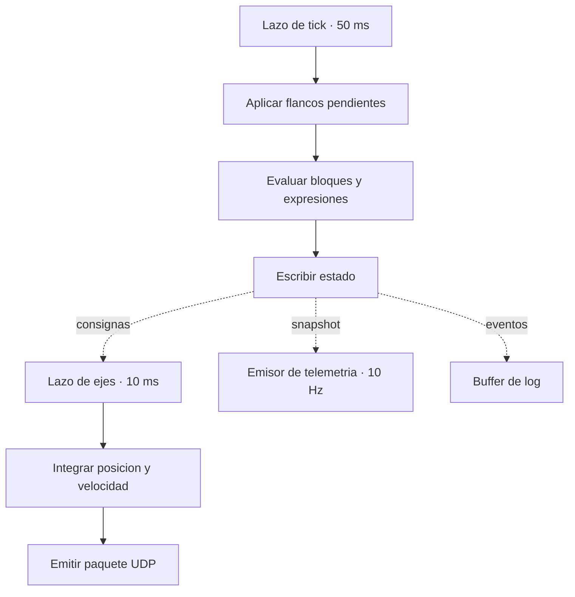

# Núcleo de simulación

El núcleo mantiene un mapa de señales en unidades de ingeniería y lo avanza en ticks. No sabe
nada de Modbus, de UDP ni de WebSocket: los adaptadores se enchufan encima y traducen en el
borde.

## Estado

El estado es **un objeto mutable único**. No hay copias, no hay réplicas, no hay una segunda
fuente de verdad. Esta es la razón de
[D-02](../alcance/decisiones.md#d-02-el-simulador-es-replicas-1) y de
[D-01](../alcance/decisiones.md#d-01-nucleo-y-adaptador-modbus-en-el-mismo-proceso).

Cada señal tiene:

| Campo | Significado |
|---|---|
| `value` | Valor actual en unidades de ingeniería |
| `mode` | `auto` o `forced` ([D-08](../alcance/decisiones.md#d-08-cada-senal-esta-en-modo-automatico-o-forzado)) |
| `shadow` | Valor que produciría el bloque si no estuviera forzada |
| `quality` | Válido, no inicializado, o fuera de rango |
| `t_us` | Instante del último cambio, reloj monótono |

`shadow` existe por los bloques con memoria y **no se expone en la interfaz**.

## Los dos lazos

**Lazo de tick, 50 ms.** Aplica los flancos de comando recibidos desde el último tick, evalúa el
grafo de bloques y expresiones en orden topológico, y escribe el estado. Nada más. Ni envía
telemetría, ni escribe en disco, ni evalúa nada que pueda bloquear.

**Lazo de ejes, 10 ms.** Integra posición a partir de la velocidad de consigna y emite el
paquete UDP. Está aislado porque a 50 ms el movimiento entre muestras es del orden del
espaciado de rayos, demasiado grueso para que el controlador cierre un lazo de posición con
suavidad ([D-10](../alcance/decisiones.md#d-10-tick-de-50-ms-integrador-de-ejes-a-10-ms)).

## Lo que nunca ocurre dentro del tick

!!! danger "Regla dura"
    El tick no escribe en disco, no envía por socket y no espera a nadie. Cualquier trabajo que
    pueda bloquear va en un camino desacoplado.

`better-sqlite3` es síncrono: escribir el registro de eventos dentro del lazo introduciría
jitter en la medida que el banco existe para tomar. Los eventos se acumulan en un buffer en
memoria y se vuelcan en lote fuera del tick.

Lo mismo con la telemetría: un emisor independiente muestrea el estado a 10 Hz y publica,
descartando lo que no llegue a tiempo
([D-12](../alcance/decisiones.md#d-12-la-telemetria-nunca-bloquea-el-tick)).

## Orden de evaluación

El orden lo fija el **grafo de dependencias**, no el orden del fichero de configuración. Se
calcula una vez al cargar, por ordenación topológica.

Un ciclo es un **error de carga**, no un comportamiento oscilante. La configuración se rechaza
con el ciclo concreto en el mensaje de error. Aceptar ciclos con un valor retardado un tick
sería posible pero produciría un modelo cuyo comportamiento depende del orden de declaración, y
eso es exactamente lo que hace irreproducible una prueba.

## Deriva del lazo

Los dos lazos se programan contra el reloj monótono y **corrigen deriva acumulada**, no encadenan
`setTimeout` de periodo fijo. La desviación real de la cadencia respecto a la nominal se
contabiliza y se expone como métrica de sesión: es lo que permite responder, cuando aparece un
fallo de temporización, si el problema fue del controlador o del banco.

Si el lazo se retrasa más de un periodo completo, **se salta el tick perdido en vez de
acumularlo**. Ejecutar dos ticks seguidos para ponerse al día produciría un salto de integración
en los ejes y un doble consumo de flancos.

## Interfaz del núcleo hacia los adaptadores

El núcleo expone una superficie deliberadamente pequeña:

| Operación | Quién la usa |
|---|---|
| `read(signal)` | adaptador Modbus, emisor UDP, telemetría |
| `write(signal, value)` | adaptador Modbus, en escrituras del controlador |
| `markEdge(signal)` | adaptador Modbus, en comandos por flanco |
| `force(signal, value, actor)` | interfaz de operación |
| `release(signal, actor)` | interfaz de operación |
| `snapshot()` | emisor de telemetría |

Que `force` y `release` lleven `actor` no es opcional: con la demo compartiendo estado, un
forzado sin autor convierte el registro en algo indefendible.

## Lo que la fase 1 necesita del núcleo

Solo el mapa de señales, los modos, y `read`/`write`/`force`/`release`. **Sin bloques, sin
expresiones, sin lazo de ejes.** Una configuración con `signals` completo y `blocks` vacío debe
cargar y servir. Esa es la razón de que la configuración esté separada en tres partes
([D-06](../alcance/decisiones.md#d-06-la-configuracion-es-json-en-tres-partes)).
