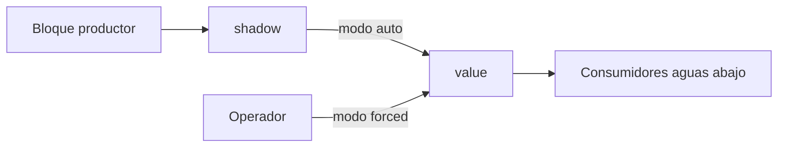

# Modos de señal

El forzado es el mecanismo central del banco. Esta página define su semántica exacta, porque
casi todas las ambigüedades caras del proyecto viven aquí.

## Dos modos, ninguno más

| Modo | Origen del valor | Qué hace el productor |
|---|---|---|
| `auto` | El bloque o expresión que alimenta la señal | Produce el valor |
| `forced` | El operador | Sigue corriendo en sombra, su salida se descarta |

No hay modo «simulado con ruido», ni «congelado», ni «último valor válido». Esos son
comportamientos que se consiguen forzando, y añadirlos como modos multiplicaría los estados sin
añadir capacidad.

## El bloque productor sigue corriendo

Durante el forzado el bloque **no se pausa**. Su salida va a `shadow` y se descarta.

La razón son los bloques con memoria. Un temporizador de caldeo de magnetrón que se pausara
durante el forzado daría, al liberar, un tiempo transcurrido falso. Al seguir corriendo, la
liberación devuelve un valor coherente con el tiempo real de la sesión.

!!! note "La sombra no se muestra"
    `shadow` es un detalle de implementación. Exponerla en la interfaz obligaría a explicar al
    operador la diferencia entre «lo que vale» y «lo que valdría», sin que pueda hacer nada
    distinto con esa información.

## La liberación es instantánea

Al liberar una señal, `value` salta a `shadow` en el mismo tick. Sin rampa, sin interpolación,
sin transición.

Una rampa parecería más física, pero introduciría un intervalo en el que el valor no es ni el
forzado ni el real, y **borraría el instante exacto del cambio**, que es precisamente lo que las
aserciones miden. La discontinuidad es honesta: dice que el operador soltó la señal aquí.

## La propagación usa el valor mentiroso

Un valor forzado se propaga aguas abajo como si fuera real
([D-09](../alcance/decisiones.md#d-09-el-valor-forzado-se-propaga-aguas-abajo)).

Forzar `tx.radome_closed_status` a falso debe abrir la cadena de interlock, y eso debe retirar
el HV. Si la propagación se cortara, el forzado sería un adorno de interfaz sin efecto sobre lo
que el controlador observa.

### Cortar la propagación es una capacidad, no un fallo

La coherencia física se puede **desactivar señal a señal**. Eso permite montar estados
imposibles: interlock cerrado con el radomo abierto, HV presente con el soplador parado,
corriente de magnetrón nominal con el filamento apagado.

Son las pruebas más valiosas del banco. Verifican que el controlador **se protege por sí mismo**
en vez de confiar en que la planta es coherente. Con hardware real no se pueden provocar.

!!! warning "Debe verse en la interfaz"
    Una señal con la propagación cortada tiene que ser visualmente distinguible, y el corte debe
    quedar registrado como evento. Un banco en estado incoherente sin que se note produce
    diagnósticos equivocados sobre el controlador.

## Comandos por flanco

Los comandos que llegan del controlador en pares mutuamente excluyentes se tratan como pulsos,
no como niveles ([D-15](../alcance/decisiones.md#d-15-los-comandos-se-detectan-por-flanco-no-por-nivel)).

- El adaptador Modbus **marca el flanco al recibir la escritura**, y el lazo lo consume en el
  siguiente tick. Un pulso más corto que el tick no se pierde.
- Si ambos comandos del par están activos a la vez, **prevalece apagar**. Es el estado seguro, y
  la regla es explícita en la configuración.

## Calidad

Toda señal lleva calidad además de valor:

| Calidad | Cuándo |
|---|---|
| `ok` | Valor de fiar |
| `uninit` | Aún no producida desde la carga de configuración |
| `range` | Fuera del rango de ingeniería declarado |

`range` **no se corrige por saturación**. Una señal fuera de rango se propaga fuera de rango,
con su calidad marcada. Saturar silenciosamente ocultaría precisamente el fallo que se busca.

## Eventos generados

Cada una de estas transiciones se registra con actor y marca de tiempo monótona:

- entrada en forzado, con el valor impuesto
- salida de forzado, con el valor de sombra al que salta
- corte y restitución de propagación
- cambio de calidad de `ok` a cualquier otra

El actor es obligatorio. Con la demo compartiendo estado
([Contexto](../alcance/contexto.md#los-dos-usos-del-sistema)), un forzado anónimo hace el
registro inservible como evidencia.
